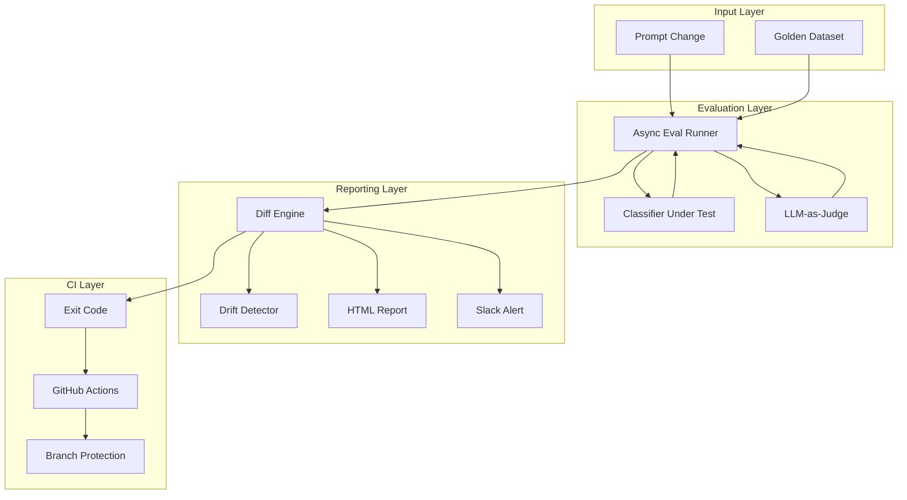

<div align="center">

# Model Regression Detection System

**A CI/CD-style evaluation pipeline for LLM features — catch prompt regressions before they ship.**


<p>
  <a href="#-why-this-project">Why</a> •
  <a href="#-features">Features</a> •
  <a href="#-demo">Demo</a> •
  <a href="#-installation">Installation</a> •
  <a href="#-usage">Usage</a> •
  <a href="#-architecture">Architecture</a> •
  <a href="#-contributing">Contributing</a>
</p>

</div>

---

## 🧐 Why This Project?

Prompts change constantly — a tweaked instruction, a "small" wording fix — but most teams have no automated way to know if that change quietly tanked accuracy. You find out from angry users, not from a test suite.

This project treats a prompt exactly like source code: **versioned, tested against a fixed bar, diffed on every change, and blocked from merging if it regresses.** The evaluation logic is fully decoupled from the feature under test through a typed interface contract, so any LLM feature that satisfies the contract can be dropped in with zero pipeline changes.

---

## ✨ Features

| Feature | Description |
|---|---|
| 🧪 **Regression Detection** | Diffs every run against the previous baseline and flags per-category accuracy drops |
| 📊 **Self-Contained Reports** | HTML diff report with no external dependencies — committable, attachable, safe to render |
| 📢 **Slack Alerts** | Real-time notification the moment a run fails, with a link to the full report |
| 🚦 **CI-Blocking** | Exits non-zero on critical regression — wired directly to branch protection |
| 🔌 **Provider-Agnostic** | Works with any OpenAI-compatible endpoint (OpenAI, Groq, etc.) via one env var |
| 🐢 **Drift Detection** | Catches slow, per-run-invisible degradation via a 7-run moving average |
| ⚖️ **Typed Contracts** | Swap the feature under test without touching the eval engine |
| 🗂️ **Versioned Everything** | Prompts and golden datasets are versioned artifacts, not constants |

---

## 🎥 Demo

<video controls preload="metadata" poster="assets/CICD-for-AI-prompts-thumbnail.png" width="100%" src="assets/CICD-for-AI-prompts.mp4"></video>

A 90-second walkthrough — a prompt change, the eval run, the Slack alert, and the diff report.

**[▶ Full 4-minute walkthrough (Google Drive)](https://drive.google.com/file/d/1_H-HhZFL8x6ngjqMky3mFFFltT75p7Bz/view?usp=sharing)** — covers every phase in detail.

> GitHub only plays video files that live in the repository, so the clip above is a teaser; the Drive link holds the complete walkthrough.

---

## 📋 Prerequisites

| Tool | Version | Notes |
|---|---|---|
| Python | ≥ 3.11 (3.10 works) | [python.org](https://www.python.org/downloads/) |
| LLM provider key | — | [OpenAI](https://platform.openai.com) or [Groq](https://console.groq.com) (free tier) |
| Slack webhook | optional | For failure alerts |

---

## ⚙️ Installation

```bash
# 1. Clone the repository
git clone https://github.com/<your-username>/model-regression-detection-system.git
cd model-regression-detection-system

# 2. Create a virtual environment
python -m venv .venv
source .venv/bin/activate       # Linux / macOS
.venv\Scripts\activate          # Windows

# 3. Install dependencies
.venv/bin/pip install -r requirements.txt

# 4. Configure secrets
cp .env.example .env            # then fill in your API key
```

`.env` is git-ignored. Supported variables:

| Variable | Purpose | Default |
|---|---|---|
| `OPENAI_API_KEY` | OpenAI API key | — |
| `GROQ_API_KEY` | Groq API key (free tier available) | — |
| `OPENAI_BASE_URL` | Any OpenAI-compatible endpoint, e.g. `https://api.groq.com/openai/v1` | OpenAI default |
| `SLACK_WEBHOOK_URL` | Alert destination | — |
| `EVAL_WARNING_PCT` | Warn when pass-rate delta exceeds this (pp) | `3.0` |
| `EVAL_CRITICAL_PCT` | Fail / block merge when pass-rate delta exceeds this (pp) | `8.0` |
| `EVAL_DRIFT_WINDOW` | Rolling window for drift detection | `7` |
| `EVAL_DRIFT_MIN_PASS` | Drift floor for the moving-average pass rate | `0.90` |
| `EVAL_DRIFT_PCT` | Drift when the moving average falls this far below the historical peak | `5.0` |

Set `OPENAI_API_KEY` **or** `GROQ_API_KEY` — exactly one. The pipeline is provider-agnostic: swap providers by changing env vars, not code.

---

## 🚀 Usage

The first run on a machine seeds a baseline — there's no previous run to diff against, so it always passes:

```bash
.venv/bin/python -m src.cli
```

Every subsequent run diffs against the previous one:

```bash
.venv/bin/python -m src.cli --prompt classifier_v2 --dataset golden_dataset_v1
```

| Flag | Description |
|---|---|
| `--prompt` / `--dataset` | Accepts a specific `version_id` or `latest` (default) |
| `--baseline-run <id>` | Diffs against a fixed run instead of the previous one |
| `--model <id>` | Overrides the model at runtime without touching versioned prompt files |
| `--max-concurrency` | Caps in-flight requests |

Outputs land in `runs/` (history) and `reports/report.html` + `reports/eval-summary.json` (current run). The process exits `0` on pass/warn and `1` on critical regression — that exit code is what CI uses to block merges.

> **Free-tier providers** (e.g. Groq) enforce aggressive rate limits — a run can take several minutes and `429`s are normal. The runner retries with exponential backoff and honors `Retry-After`; lower `--max-concurrency` (2–3) to stay within per-minute limits.

### Running in Docker

```bash
docker build -t model-eval .
docker run --rm \
  -e OPENAI_API_KEY=... -e SLACK_WEBHOOK_URL=... \
  -v "$PWD/runs:/app/runs" -v "$PWD/reports:/app/reports" \
  model-eval
```

For Groq, pass `-e OPENAI_BASE_URL=https://api.groq.com/openai/v1 -e GROQ_API_KEY=...` instead of `OPENAI_API_KEY`, and add `--model openai/gpt-oss-120b` after the image name.

---

## 🏗️ Architecture

### System Flow



### Project Structure

```text
.
├── prompts/               # Versioned prompt files (YAML) — the code CI runs against
│   ├── classifier_v1.yaml
│   └── classifier_v2.yaml
├── golden_dataset/        # Versioned golden datasets (JSON) — the eval bar
│   └── golden_dataset_v1.json    # 72 hand-curated cases
├── src/
│   ├── env.py              # Loads .env on import
│   ├── contract.py         # Interface contract: Category, ClassifierInput/Output, EvalTarget
│   ├── config.py           # PromptConfig (Pydantic) + YAML loader
│   ├── prompt_registry.py  # Prompt version registry (get / latest / duplicate detection)
│   ├── classifier.py       # The feature under test (sync + async variants)
│   ├── golden_dataset.py   # Typed dataset models + registry + policy validators
│   ├── eval_runner.py      # Async test runner with bounded concurrency + scoring
│   ├── judge.py            # LLM-as-judge for summary relevance (1–5)
│   ├── run_store.py        # Run persistence (JSON) + previous-run resolution
│   ├── diff.py              # Diff engine: deltas, per-category, regressions/improvements
│   ├── assessment.py       # Threshold assessment (warn/critical) + exit semantics
│   ├── drift.py             # Slow-drift detection via rolling averages
│   ├── report.py            # Self-contained HTML report generator
│   ├── slack.py             # Slack webhook alerting (graceful failure)
│   ├── pipeline.py          # Orchestrates the full eval pipeline
│   └── cli.py                # CLI entry point (`python -m src.cli`)
├── runs/                   # Eval run history (JSON, git-ignored)
├── reports/                 # Generated HTML reports + eval-summary.json (git-ignored)
├── .github/workflows/      # GitHub Actions: model-eval on PRs touching prompts/
└── Dockerfile               # Containerized runner
```

---

## 🎛️ Adding Test Cases to the Golden Dataset

Each case is a JSON object with a stable `id`, the raw `input`, an `expected` category + summary (human-verified ground truth), an `expected_difficulty` of `easy | medium | hard`, a `notes` field explaining why the case matters, and an optional `edge_case_types` list (`ambiguous`, `short`, `typo`, `mixed_language`, `sarcasm`).

To add a case:

1. **Extend the current bar** — append to `golden_dataset/golden_dataset_v1.json` with a new unique `id` (e.g. `case_0073`). The loader enforces unique ids, non-empty fields, and that edge-tagged cases are never `easy`.
2. **Raise the bar** — copy the file to `golden_dataset_v2.json`, bump `dataset_version` and `created_at`, and edit cases. Old runs keep their dataset version, so diffs across a bar change are explicit rather than silent.

> **Rule of thumb:** hand-write new cases — never generate them with an LLM. When a production failure surfaces, add it as a case with a note describing the real incident; that's how the eval bar tracks reality.

---

## 🎚️ Adjusting Thresholds

Thresholds are runtime configuration, never code changes:

- **Per-run** — `EVAL_WARNING_PCT` / `EVAL_CRITICAL_PCT` are pass-rate deltas in percentage points vs. the previous run. Warning means "investigate"; critical means "merge-blocking regression."
- **Slow drift** — `EVAL_DRIFT_WINDOW`, `EVAL_DRIFT_MIN_PASS`, and `EVAL_DRIFT_PCT` govern the rolling-average check that catches gradual degradation per-run checks miss. Drift only reports when the latest run itself passed, so it never double-fires with a per-run alert.

To change the defaults for everyone, edit `ThresholdConfig` in `src/assessment.py` and the equivalent in `src/drift.py`.

---

## 🔁 CI/CD

`.github/workflows/model-eval.yml` runs the pipeline on every PR that touches `prompts/**`. It:

- Caches `runs/` (keyed by branch) so PR diffs have history
- Uploads the report artifact on every run
- Posts a structured PR summary comment (status, delta, regression/improvement case IDs, drift notice)
- Fails the job on critical regressions

**Blocking merges is a branch protection setting, not a workflow change** — add `model-eval` as a required status check on the default branch. Two secrets are needed: `SLACK_WEBHOOK_URL` plus `OPENAI_API_KEY` (or `GROQ_API_KEY` + `OPENAI_BASE_URL` for Groq).

---

## 🧠 Design Decisions

| Decision | Rationale |
|---|---|
| **Prompts are versioned files, not constants** | A prompt is the code under test — without version identity, you can't attribute a regression to a change. |
| **Human-curated golden dataset, versioned as a unit** | Eval quality is bounded by data quality. Versioning the dataset makes a deliberate change of bar explicit in history. |
| **Typed interface contract** | `EvalTarget` (a `Protocol`) plus Pydantic models mean the eval engine depends on an interface, not the classifier — this is what lets the pipeline outlive its first feature. |
| **One code path for prod and test** | `classify_email_async` shares logic with the sync path, so CI evaluates the exact code that ships. |
| **Async runner with a concurrency semaphore** | Bounds wall-clock time and token spend rate via a single tuning knob. |
| **Multi-dimensional scoring** | Category match, LLM-judged summary quality, latency, and tokens — surfaces regressions a single accuracy number hides. |
| **Diffing, not just reporting** | The core artifact is the delta vs. the previous run, including the exact case list that flipped. |
| **Separate per-run and drift signals** | Per-run flips are immediate signal; a 7-run moving average is a distinct, independently computed failure mode. |
| **Self-contained HTML report** | No external dependencies; all LLM-generated text is HTML-escaped to prevent injection. |
| **Provider-agnostic client construction** | One factory reads `OPENAI_BASE_URL` and falls back `OPENAI_API_KEY` → `GROQ_API_KEY` — any OpenAI-compatible endpoint works with zero contract changes. |
| **Rate-limit resilience** | Exponential backoff plus `Retry-After` handling makes the pipeline usable against rate-limited free tiers. |
| **Failures degrade, never crash** | A case error is recorded and retried; a judge failure drops to `None`; a failing Slack webhook is logged and skipped. Evaluation and diffing are never best-effort. |
| **Exit code is the CI contract** | `0` / `1` is the only thing the workflow interprets — composable with any CI system. |
| **Containerized with runtime-only secrets** | `runs/` and `reports/` are volumes; the image is otherwise immutable, with secrets injected at runtime. |

---

## 🤝 Contributing

Contributions are welcome! Please open an issue first to discuss what you'd like to change.

### Contribution Workflow

1. Fork the repository
2. Create your feature branch

```bash
git checkout -b feature/amazing-feature
```

3. Commit your changes

```bash
git commit -m "Add amazing feature"
```

4. Push to your branch

```bash
git push origin feature/amazing-feature
```

5. Open a Pull Request

---

Thank you for helping improve this project 🚀

## 👤 Author

**Yakub Mohammad**
GitHub: [@Mohammadyakub221](https://github.com/Mohammadyakub221)

Built to explore **CI/CD discipline applied to LLM prompts** and **production-grade eval pipelines**.

---

## 📄 License

This project is licensed under the **MIT License**.
See the [LICENSE](LICENSE) file for details.

<div align="center">
  <sub>⭐ Star this repo if you found it useful!</sub>
</div>